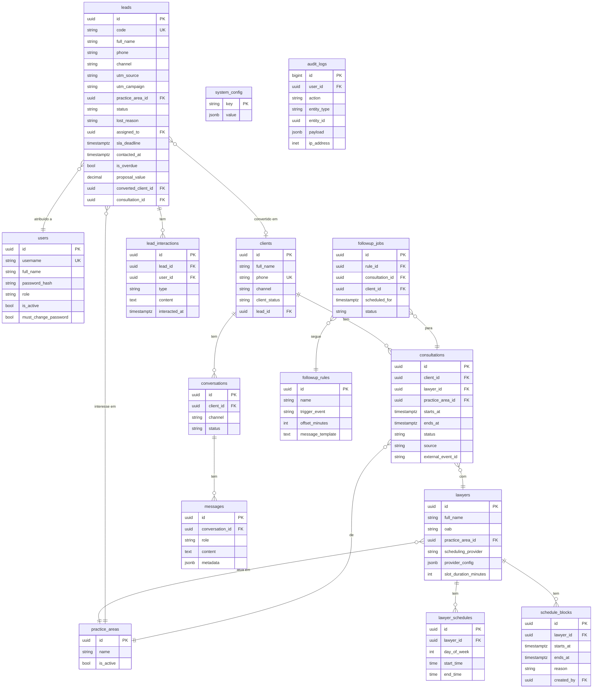

# Schema do Banco de Dados — AdvocacIA CRM

> Estado-alvo. O banco é **novo** (sem migração de dados do openclinic); a cadeia de migrations Alembic será resetada com uma migration inicial `advocacia_crm_initial` que cria este schema ([[10-transformation-plan]] §5, Fase 3.1). Dicionário de renomes: [[10-transformation-plan]] §3.1.

## Diagrama ER (Mermaid)



---

## SQL Completo

```sql
-- EXTENSÕES
CREATE EXTENSION IF NOT EXISTS "pgcrypto";
CREATE EXTENSION IF NOT EXISTS "btree_gist";  -- para EXCLUDE constraint

-- USUÁRIOS
CREATE TABLE users (
    id                    UUID PRIMARY KEY DEFAULT gen_random_uuid(),
    username              VARCHAR(150) UNIQUE NOT NULL,
    full_name             VARCHAR(255) NOT NULL,
    password_hash         VARCHAR(255) NOT NULL,
    role                  VARCHAR(50) NOT NULL CHECK (role IN ('admin', 'secretary', 'lawyer')),
    is_active             BOOLEAN DEFAULT TRUE,
    must_change_password  BOOLEAN DEFAULT TRUE,
    created_at            TIMESTAMPTZ DEFAULT NOW(),
    updated_at            TIMESTAMPTZ DEFAULT NOW()
);

-- ÁREAS DE ATUAÇÃO
CREATE TABLE practice_areas (
    id          UUID PRIMARY KEY DEFAULT gen_random_uuid(),
    name        VARCHAR(100) NOT NULL,
    description TEXT,
    is_active   BOOLEAN DEFAULT TRUE,
    created_at  TIMESTAMPTZ DEFAULT NOW()
);

-- ADVOGADOS
CREATE TABLE lawyers (
    id                    UUID PRIMARY KEY DEFAULT gen_random_uuid(),
    full_name             VARCHAR(255) NOT NULL,
    oab                   VARCHAR(50),
    practice_area_id      UUID REFERENCES practice_areas(id),
    scheduling_provider   VARCHAR(50) NOT NULL
                          CHECK (scheduling_provider IN ('google_calendar', 'local_db')),
    provider_config       JSONB,
    slot_duration_minutes INTEGER DEFAULT 30,
    is_active             BOOLEAN DEFAULT TRUE,
    created_at            TIMESTAMPTZ DEFAULT NOW(),
    updated_at            TIMESTAMPTZ DEFAULT NOW()
);

-- DISPONIBILIDADE RECORRENTE
CREATE TABLE lawyer_schedules (
    id           UUID PRIMARY KEY DEFAULT gen_random_uuid(),
    lawyer_id    UUID REFERENCES lawyers(id) ON DELETE CASCADE,
    day_of_week  SMALLINT NOT NULL CHECK (day_of_week BETWEEN 0 AND 6),
    start_time   TIME NOT NULL,
    end_time     TIME NOT NULL,
    is_active    BOOLEAN DEFAULT TRUE
);

-- BLOQUEIOS DE AGENDA
CREATE TABLE schedule_blocks (
    id          UUID PRIMARY KEY DEFAULT gen_random_uuid(),
    lawyer_id   UUID REFERENCES lawyers(id) ON DELETE CASCADE,
    starts_at   TIMESTAMPTZ NOT NULL,
    ends_at     TIMESTAMPTZ NOT NULL,
    reason      TEXT,
    created_by  UUID REFERENCES users(id),
    created_at  TIMESTAMPTZ DEFAULT NOW()
);

-- CLIENTES
CREATE TABLE clients (
    id              UUID PRIMARY KEY DEFAULT gen_random_uuid(),
    full_name       VARCHAR(255),
    phone           VARCHAR(30) UNIQUE NOT NULL,
    email           VARCHAR(255),
    channel         VARCHAR(20) NOT NULL CHECK (channel IN ('telegram', 'whatsapp')),
    channel_id      VARCHAR(100),
    client_status   VARCHAR(30) NOT NULL DEFAULT 'new'
                    CHECK (client_status IN ('new', 'qualified', 'scheduled', 'completed', 'no_show')),
    lead_id         UUID,
    notes           TEXT,
    created_at      TIMESTAMPTZ DEFAULT NOW(),
    updated_at      TIMESTAMPTZ DEFAULT NOW()
);

-- CONTATOS DO CLIENTE (canais adicionais)
CREATE TABLE client_contacts (
    id          UUID PRIMARY KEY DEFAULT gen_random_uuid(),
    client_id   UUID REFERENCES clients(id) ON DELETE CASCADE NOT NULL,
    channel     VARCHAR(20) NOT NULL,      -- whatsapp | telegram | email
    value       VARCHAR(255) NOT NULL,     -- telefone / id telegram / email
    is_primary  BOOLEAN DEFAULT FALSE NOT NULL,
    created_at  TIMESTAMPTZ DEFAULT NOW()
);

-- LEADS
CREATE TABLE leads (
    id                   UUID PRIMARY KEY DEFAULT gen_random_uuid(),
    code                 VARCHAR(20) UNIQUE NOT NULL,
    ai_active            BOOLEAN,             -- null=sem IA, true=IA ativa, false=humano assumiu
    full_name            VARCHAR(255),
    phone                VARCHAR(30) NOT NULL,
    email                VARCHAR(255),
    channel              VARCHAR(30) NOT NULL
                         CHECK (channel IN ('telegram','whatsapp','google_ads','meta_ads',
                                            'instagram','site','indicacao','outro')),
    utm_source           VARCHAR(100),
    utm_medium           VARCHAR(100),
    utm_campaign         VARCHAR(255),
    utm_content          VARCHAR(255),
    utm_term             VARCHAR(255),
    practice_area_id     UUID REFERENCES practice_areas(id),
    description          TEXT,                 -- resumo do caso relatado pelo lead
    proposal_value       NUMERIC(10,2),        -- valor da proposta de honorários
    status               VARCHAR(30) NOT NULL DEFAULT 'novo'
                         CHECK (status IN ('novo','em_contato','qualificado',
                                           'proposta_enviada','negociando',
                                           'convertido','perdido')),
    lost_reason          VARCHAR(255),
    assigned_to          UUID REFERENCES users(id),
    sla_deadline         TIMESTAMPTZ NOT NULL,
    contacted_at         TIMESTAMPTZ,
    is_overdue           BOOLEAN GENERATED ALWAYS AS (
                             contacted_at IS NULL AND sla_deadline < NOW()
                         ) STORED,
    next_followup_at     TIMESTAMPTZ,
    converted_client_id  UUID REFERENCES clients(id),
    converted_at         TIMESTAMPTZ,
    consultation_id      UUID,
    client_id            UUID REFERENCES clients(id),
    created_at           TIMESTAMPTZ DEFAULT NOW(),
    updated_at           TIMESTAMPTZ DEFAULT NOW()
);

-- INTERAÇÕES DO LEAD
CREATE TABLE lead_interactions (
    id            UUID PRIMARY KEY DEFAULT gen_random_uuid(),
    lead_id       UUID REFERENCES leads(id) ON DELETE CASCADE,
    user_id       UUID REFERENCES users(id),
    type          VARCHAR(30) NOT NULL
                  CHECK (type IN ('nota','ligacao','whatsapp','email','reuniao','outro')),
    content       TEXT NOT NULL,
    next_action   TEXT,
    interacted_at TIMESTAMPTZ DEFAULT NOW()
);

-- CONVERSAS
CREATE TABLE conversations (
    id              UUID PRIMARY KEY DEFAULT gen_random_uuid(),
    client_id       UUID REFERENCES clients(id),
    channel         VARCHAR(20) NOT NULL,
    status          VARCHAR(20) DEFAULT 'active' CHECK (status IN ('active', 'closed')),
    started_at      TIMESTAMPTZ DEFAULT NOW(),
    closed_at       TIMESTAMPTZ,
    context_summary TEXT
);

-- MENSAGENS
CREATE TABLE messages (
    id              UUID PRIMARY KEY DEFAULT gen_random_uuid(),
    conversation_id UUID REFERENCES conversations(id) ON DELETE CASCADE,
    role            VARCHAR(20) NOT NULL CHECK (role IN ('client', 'assistant', 'system')),
    content         TEXT NOT NULL,
    metadata        JSONB,
    sent_at         TIMESTAMPTZ DEFAULT NOW()
);

-- CONSULTAS
CREATE TABLE consultations (
    id                UUID PRIMARY KEY DEFAULT gen_random_uuid(),
    client_id         UUID REFERENCES clients(id),
    lawyer_id         UUID REFERENCES lawyers(id),
    practice_area_id  UUID REFERENCES practice_areas(id),
    starts_at         TIMESTAMPTZ NOT NULL,
    ends_at           TIMESTAMPTZ NOT NULL,
    status            VARCHAR(20) DEFAULT 'scheduled'
                      CHECK (status IN ('scheduled','confirmed','completed','cancelled','no_show')),
    source            VARCHAR(30) CHECK (source IN ('ai_chat','secretary','client_link')),
    external_event_id VARCHAR(255),
    notes             TEXT,
    created_by_user   UUID REFERENCES users(id),
    created_at        TIMESTAMPTZ DEFAULT NOW(),
    updated_at        TIMESTAMPTZ DEFAULT NOW(),
    CONSTRAINT no_overlap EXCLUDE USING gist (
        lawyer_id WITH =,
        tstzrange(starts_at, ends_at) WITH &&
    ) WHERE (status NOT IN ('cancelled'))
);

-- FKs pendentes
ALTER TABLE leads ADD CONSTRAINT fk_leads_consultation
    FOREIGN KEY (consultation_id) REFERENCES consultations(id);
ALTER TABLE clients ADD CONSTRAINT fk_clients_lead
    FOREIGN KEY (lead_id) REFERENCES leads(id);

-- REGRAS DE FOLLOW-UP
CREATE TABLE followup_rules (
    id               UUID PRIMARY KEY DEFAULT gen_random_uuid(),
    name             VARCHAR(100) NOT NULL,
    trigger_event    VARCHAR(50) NOT NULL
                     CHECK (trigger_event IN ('consultation_scheduled','consultation_confirmed',
                                               'consultation_cancelled','no_show')),
    offset_minutes   INTEGER NOT NULL,
    message_template TEXT NOT NULL,
    channel          VARCHAR(20) CHECK (channel IN ('telegram','whatsapp','same_as_client')),
    is_active        BOOLEAN DEFAULT TRUE,
    created_at       TIMESTAMPTZ DEFAULT NOW()
);

-- JOBS DE FOLLOW-UP
CREATE TABLE followup_jobs (
    id              UUID PRIMARY KEY DEFAULT gen_random_uuid(),
    rule_id         UUID REFERENCES followup_rules(id),
    consultation_id UUID REFERENCES consultations(id),
    client_id       UUID REFERENCES clients(id),
    scheduled_for   TIMESTAMPTZ NOT NULL,
    status          VARCHAR(20) DEFAULT 'pending'
                    CHECK (status IN ('pending','sent','failed','cancelled')),
    celery_task_id  VARCHAR(255),
    error_message   TEXT,
    executed_at     TIMESTAMPTZ
);

-- CONFIGURAÇÕES DO SISTEMA
CREATE TABLE system_config (
    key        VARCHAR(100) PRIMARY KEY,
    value      JSONB NOT NULL,
    updated_by UUID REFERENCES users(id),
    updated_at TIMESTAMPTZ DEFAULT NOW()
);

-- AUDIT LOG
CREATE TABLE audit_logs (
    id          BIGSERIAL PRIMARY KEY,
    user_id     UUID REFERENCES users(id),
    action      VARCHAR(100) NOT NULL,
    entity_type VARCHAR(50),
    entity_id   UUID,
    payload     JSONB,
    ip_address  INET,
    created_at  TIMESTAMPTZ DEFAULT NOW()
);

-- ÍNDICES
CREATE INDEX idx_clients_phone ON clients(phone);
CREATE INDEX idx_consultations_lawyer_starts ON consultations(lawyer_id, starts_at);
CREATE INDEX idx_consultations_client ON consultations(client_id);
CREATE INDEX idx_followup_jobs_scheduled ON followup_jobs(scheduled_for, status);
CREATE INDEX idx_messages_conversation ON messages(conversation_id, sent_at);
CREATE INDEX idx_leads_status ON leads(status);
CREATE INDEX idx_leads_overdue ON leads(is_overdue, status) WHERE is_overdue = true;
CREATE INDEX idx_leads_channel ON leads(channel);
CREATE INDEX idx_leads_assigned ON leads(assigned_to);
CREATE INDEX idx_leads_created ON leads(created_at DESC);
CREATE INDEX idx_leads_utm_campaign ON leads(utm_campaign) WHERE utm_campaign IS NOT NULL;
CREATE INDEX idx_lead_interactions_lead ON lead_interactions(lead_id, interacted_at DESC);
CREATE INDEX idx_audit_logs_created ON audit_logs(created_at DESC);
CREATE INDEX idx_audit_logs_user ON audit_logs(user_id);
```

## Dados seed (desenvolvimento)

- **Áreas de atuação:** Trabalhista, Cível, Família e Sucessões, Previdenciário, Tributário, Criminal.
- **Advogados:** 2–3 fictícios com OAB de exemplo, provider `local_db`, agenda seg–sex 09:00–18:00.
- **Usuários:** `admin`/`admin` (admin), `comercial`/`comercial` (secretary).
- **Leads:** ~10 leads de exemplo distribuídos pelos estágios do pipeline, com UTMs variadas.
